# Blend-ET

Blend-ET is a plugin for the [Blender](https://www.blender.org/) 3D graphics software which introduces useful tools to streamline scientific data visualization. 

> Note: the plugin has been tested primarily on Blender 4.4 and 4.5, if you have issues on newer versions -- please open an issue.

## Installation

Follow the instructions on the video below.

1. Download this repository as a `.zip` archive;
2. In Blender, open the `Preferences` window (`Ctrl+,` or `Cmd+,`) and access the `Add-ons` panel;
3. On the top right, click the arrow (`Add-on settings`) button and pick `Install from Disk...`;
4. Pick the downloaded `.zip` file and hit `Install from Disk`;
5. In the same `Add-ons` panel, find `BlendET` and enable it by ticking the checkbox.

<video src="https://github.com/user-attachments/assets/9d1d22aa-ffa2-43cd-9ecc-d646d9b87276"></video>

## Features

The `BlendET` panel is divided into multiple subsections each dedicated to a specific functionality.

### Tools

This panel provides quick access to commonly used settings:

1. `Switch to Cycles`: sets the active rendering backend to `Cycles` (needed for volume rendering);
2. `Fix Colors`: disables the default filmic color-correction for better accuracy;
3. `Set Background Color`: changes the background color to a defined value.

| 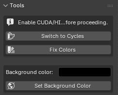 |
| :-----------------------: |
|        Tools panel        |

### Annotations

Constructs customizable mesh objects for annotating the plots:

1. `Add axes grid`: adds a customizable box grid for the axes;
2. `Add arrow`: adds a customizable arrow (flat or cylindrical) which can be positioned as needed;
3. `Add axes`: adds 3D Cartesian axes indicator.

| 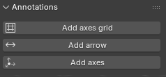 | 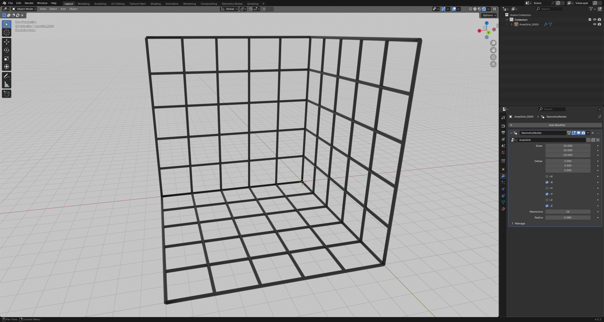 | 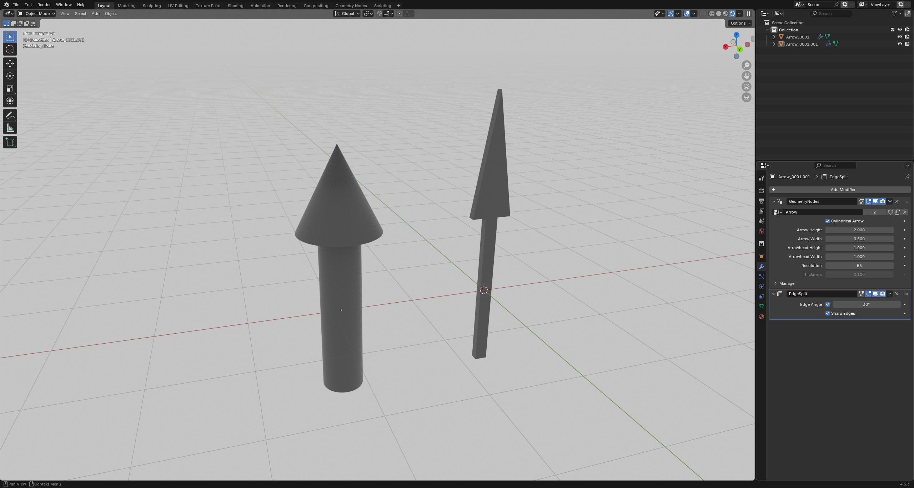 | 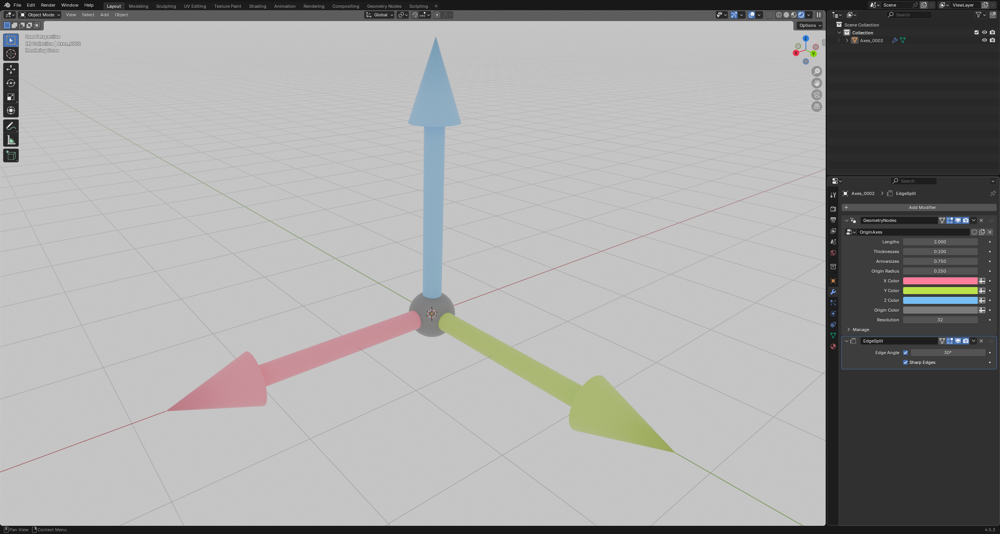 |
| :-----------------------------: | :--------------------------------: | :----------------------------------: | :--------------------------------: |
|        Annotations panel        |              Grid box              |                Arrows                |          Orientation axes          |

### Volume Rendering

This panel contains all the tools for importing the 3D data for volume rendering:

1. `Import .vdb as volume`: if the data is already in the `vdb` format, you can simply point to it and import here;
2. `Import .npy/.npz as volume`: otherwise, the plugin can also convert the data for you:
   1. `NPZ field`: if the data is in the `.npz` format, i.e., contains multiple datasets, you may indicate here which field to take;
   2. `Axis order`: order of x-y-z axes in the dataset;
   3. `Crop indices`: if you only need to import a subset, you may want to crop your dataset here (negative indices are taken from the end).

| 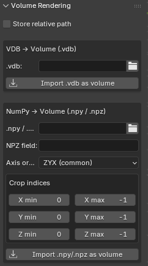 |  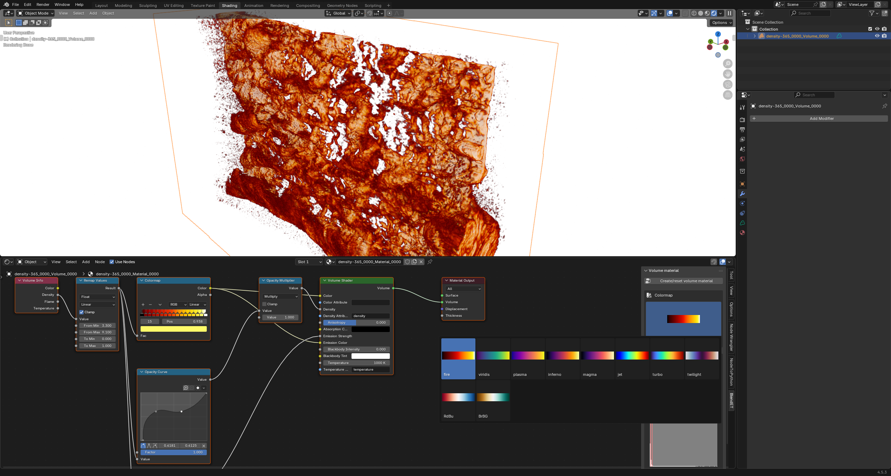   |
| :----------------------------------: | :------------------------------------: |
|        Volume rendering panel        | Customizable volume rendering material |

### Fieldlines

This panel allows to import and plot streamlines from a 3D vector field:

1. `.npz`: since streamlines require three components of the field at each point, you will need to import an `.npz` file containing three fields; 
2. `Field prefix`: this is optional, since the name will be inferred automatically, but if you need to, you may provide the prefix, i.e., the field components will be: `{prefix}x`, `{prefix}y`, `{prefix}z`;
3. `Crop indices`: same as for the volume rendering;
4. `Integration settings`:
   1. `Integration direction`: whether to integrate in both directions or just in forward/backward;
   2. `Integration step`: in units of cells (by default, it assumes `0.5`);
   3. `Max iterations`: maximum number of steps for each fieldline;
5. `Seed points`: currently, the plugin only offers to initialize seed points for each fieldline on a plane with a given resolution (`Custom seed` is not yet implemented);
   1. `Seed resolution`: the number of seed points in each direction on the seed plane;
   2. `Seed plane displacement`: is the displacement of the seed plane in cells in the third direction (i.e., if the seed plane is in `XY`, the displacement will be in `Z`).

| 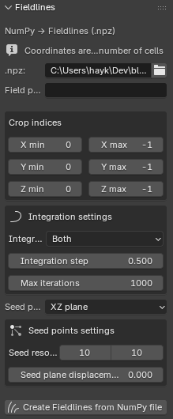 | 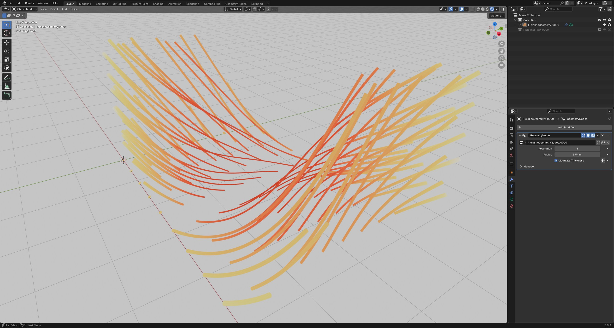 | 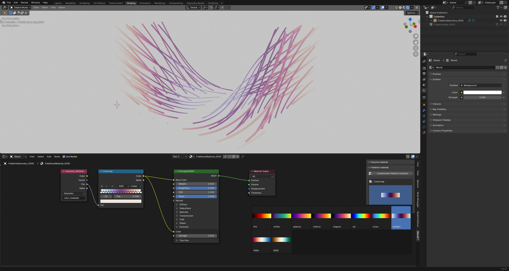 |
| :----------------------------: | :---------------------------: | :------------------------------------: |
|        Fieldline panel         |    Customizable fieldlines    |        Material for fieldlines         |

### LaTeX

You can use this panel to add $\LaTeX$-compiled text to the scene (e.g., labels, equations, etc). This functionality has been adapted from the beautiful [https://github.com/ghseeli/latex2blender](https://github.com/ghseeli/latex2blender) add-on.

1. `LaTeX`: the $\LaTeX$ code to compile (math expressions should be wrapped in `$`);
2. `Paths`: if the code is unable to find your $\LaTeX$ installation by itself, you may specify the paths by hands;
3. `Transform Settings`: you may either supply custom transform settings here, or alternatively you can also modify the mesh afterwards;
4. `Use Custom Preamble`: you can also supply a custom preamble to use a non-default package (see example [here](https://github.com/ghseeli/latex2blender/blob/master/custom_preamble_example.tex)).

| 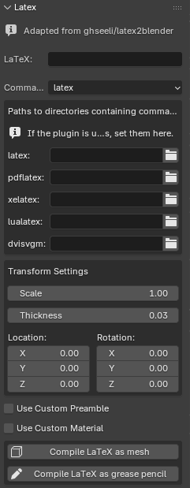 | 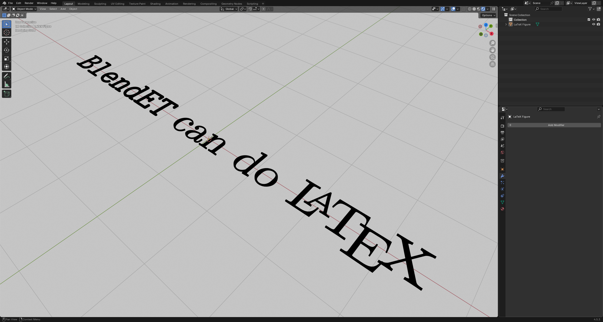 |
| :-----------------------: | :----------------------: |
|      $\LaTeX$ panel       |      $\LaTeX$ demo       |

## To-Do

- [x] vdb import
- [x] numpy import
- [x] create volume material + colormap
- [x] crop volume
- [x] histogram of volume data
- [x] add latex text labels
- [x] add box & ticks
- [x] import xyz fields to build fieldlines + seed points
- [x] add arrows
- [x] orientation axes
- [ ] custom seed points for fieldlines
- [ ] support for animations